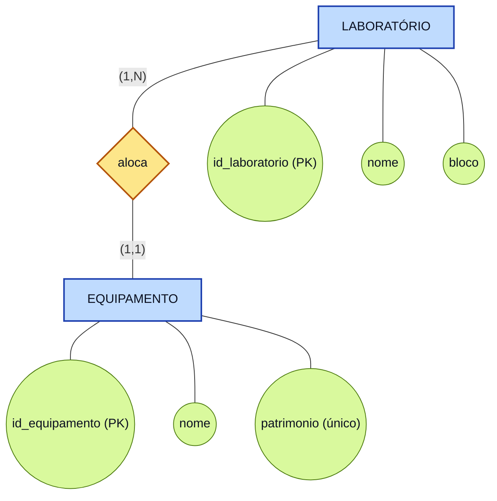

# Parte 1.1 — Modelo Conceitual

> **Enunciado:** desenhe o Diagrama de Entidade-Relacionamento (DER) deste cenário.
> Mostre as duas entidades, seus atributos e a cardinalidade (relação) entre elas.

O modelo conceitual descreve **o que** precisa ser armazenado, do jeito que o usuário
enxerga o problema — sem tipos de dados e sem SGBD. Está na notação de **Peter Chen**:
retângulo = entidade, losango = relacionamento, elipse = atributo.

## Entidades

| Entidade | O que representa |
|---|---|
| **LABORATÓRIO** | A sala onde os equipamentos ficam guardados (ex.: "Lab. de Redes", no "Bloco A"). |
| **EQUIPAMENTO** | O item de informática que precisa ser localizado (ex.: "Roteador Cisco", patrimônio "PAT-1234"). |

## Atributos

| Entidade | Atributo | Observação |
|---|---|---|
| LABORATÓRIO | `id_laboratorio` | Número de identificação **único** — identificador da entidade. |
| LABORATÓRIO | `nome` | Nome descritivo do laboratório. |
| LABORATÓRIO | `bloco` | Bloco onde o laboratório está localizado. |
| EQUIPAMENTO | `id_equipamento` | Número de identificação **único** — identificador da entidade. |
| EQUIPAMENTO | `nome` | Nome do equipamento. |
| EQUIPAMENTO | `patrimonio` | Número de patrimônio, também **único** (atributo identificador alternativo). |

## Relacionamento e regra de negócio

O enunciado diz que todo equipamento está **obrigatoriamente associado a um (e apenas
um) laboratório**. Disso saem duas afirmações:

1. Um **EQUIPAMENTO** fica alocado em **exatamente um** LABORATÓRIO.
2. Um **LABORATÓRIO** abriga **vários** EQUIPAMENTOS.

Portanto a cardinalidade do relacionamento *aloca* é **1:N** (um para muitos), com o
lado "muitos" na entidade EQUIPAMENTO.

## Diagrama Entidade-Relacionamento (DER)

## Leitura da cardinalidade

A notação `(mínimo, máximo)` é lida **do lado oposto** da ligação:

| Leitura | Cardinalidade | Significado |
|---|---|---|
| EQUIPAMENTO → LABORATÓRIO | **(1,1)** | Todo equipamento está em um laboratório, e só em um. A associação é obrigatória. |
| LABORATÓRIO → EQUIPAMENTO | **(1,N)** | Um laboratório abriga de um a N equipamentos. |

> Como não existe relacionamento N:N, **nenhuma tabela associativa** será criada no
> modelo lógico: basta uma chave estrangeira.
