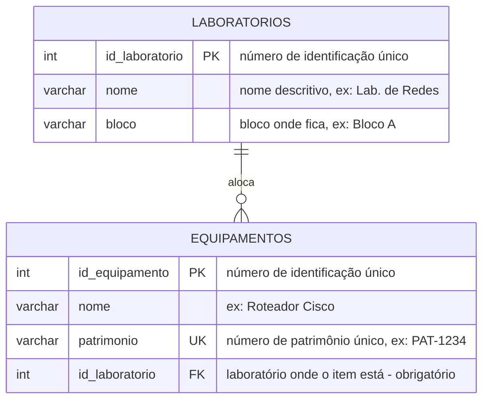

# Parte 1.2 — Modelo Lógico

> **Enunciado:** escreva a estrutura relacional das tabelas.
> **Atenção:** indique claramente qual campo é a Chave Primária (PK) e em qual tabela
> ficará a Chave Estrangeira (FK) para que o relacionamento funcione.

## Resposta direta à pergunta do enunciado

| Pergunta | Resposta |
|---|---|
| Qual é a **PK** de `Laboratorios`? | **`id_laboratorio`** |
| Qual é a **PK** de `Equipamentos`? | **`id_equipamento`** |
| Em qual tabela fica a **FK**? | Na tabela **`Equipamentos`**, no campo **`id_laboratorio`**, apontando para `Laboratorios(id_laboratorio)`. |

**Por quê a FK fica em `Equipamentos`?** Em todo relacionamento 1:N, a chave primária
do lado "um" **migra** para o lado "muitos". Aqui o lado "um" é o laboratório e o lado
"muitos" é o equipamento — logo o equipamento é quem guarda a referência.

Se a FK fosse colocada em `Laboratorios`, cada laboratório só conseguiria apontar para
**um** equipamento, o que quebraria a regra de negócio (um laboratório abriga vários).

## Estrutura relacional

```text
Laboratorios (id_laboratorio, nome, bloco)
              PK: id_laboratorio

Equipamentos (id_equipamento, nome, patrimonio, id_laboratorio)
              PK: id_equipamento
              UNIQUE: patrimonio
              FK: id_laboratorio -> Laboratorios(id_laboratorio)   [NOT NULL]
```

A FK é **NOT NULL** porque o enunciado exige que o equipamento esteja
*obrigatoriamente* associado a um laboratório — não pode existir equipamento solto.

## Diagrama lógico (notação "pé de galinha")



## Dicionário de dados

### Laboratorios

| Coluna | Domínio | Restrições | Descrição |
|---|---|---|---|
| `id_laboratorio` | inteiro | **PK**, gerado automaticamente | Número de identificação único do laboratório. |
| `nome` | texto (60) | NOT NULL, **UNIQUE** | Nome descritivo (ex.: "Lab. de Redes"). |
| `bloco` | texto (30) | NOT NULL | Bloco onde o laboratório está (ex.: "Bloco A"). |

### Equipamentos

| Coluna | Domínio | Restrições | Descrição |
|---|---|---|---|
| `id_equipamento` | inteiro | **PK**, gerado automaticamente | Número de identificação único do equipamento. |
| `nome` | texto (80) | NOT NULL | Nome do equipamento (ex.: "Roteador Cisco"). |
| `patrimonio` | texto (20) | NOT NULL, **UNIQUE** | Número de patrimônio (ex.: "PAT-1234"). Único em toda a instituição. |
| `id_laboratorio` | inteiro | **FK** → `Laboratorios`, NOT NULL | Laboratório onde o equipamento está alocado. |

## Verificação de normalização

| Forma normal | Situação | Justificativa |
|---|---|---|
| **1FN** | Atendida | Todos os campos são atômicos; não há listas nem grupos repetitivos (não existe uma coluna "equipamentos" com vários itens dentro do laboratório). |
| **2FN** | Atendida | As duas chaves primárias são simples, de uma coluna só — não há como existir dependência parcial. |
| **3FN** | Atendida | Nenhum campo não-chave depende de outro campo não-chave. O `bloco` descreve o laboratório (a chave), não o equipamento; por isso ele fica em `Laboratorios` e **não** é repetido em `Equipamentos`. |

> É exatamente essa separação que resolve o problema relatado no cenário: a localização
> do item não é digitada de novo a cada equipamento. Ela é consultada por **JOIN**, e
> mover um equipamento de sala é só trocar o valor da FK — como faz o `UPDATE` da Parte 3.
