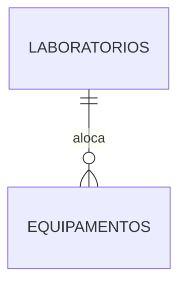

# Exercício Prático: Controle de Inventário de Laboratórios

**Atividade completa banco de dados**

## Objetivo

Praticar a criação de modelos de banco de dados (Conceitual, Lógico e Físico) e
comandos de manipulação de dados (DML), aplicando o relacionamento entre duas tabelas.

## O cenário (regra de negócio)

A direção da instituição percebeu que os equipamentos de informática estão
desorganizados e solicitou um sistema simples de banco de dados para controlar **onde
cada item está localizado**.

1. Registrar **Laboratórios**: número de identificação único, nome descritivo
   (ex.: "Lab. de Redes") e o bloco onde está localizado (ex.: "Bloco A").
2. Registrar **Equipamentos**: número de identificação único, nome (ex.: "Roteador
   Cisco"), número de patrimônio único (ex.: "PAT-1234") e estar **obrigatoriamente
   associado a um (e apenas um) laboratório**.

## Entregas

| Parte | Item do enunciado | Arquivo |
|---|---|---|
| **Parte 1 — Modelagem** | 1. Modelo Conceitual (DER, atributos, cardinalidade) | [`01-modelo-conceitual.md`](01-modelo-conceitual.md) |
| **Parte 1 — Modelagem** | 2. Modelo Lógico (estrutura relacional, PK e FK) | [`02-modelo-logico.md`](02-modelo-logico.md) |
| **Parte 2 — Modelo Físico** | 3. `CREATE TABLE` das duas tabelas | [`03-modelo-fisico.sql`](03-modelo-fisico.sql) |
| **Parte 3 — DML** | 4 a 8. `INSERT`, `INSERT`, `SELECT` com `JOIN`, `UPDATE`, `DELETE` | [`04-manipulacao-dados.sql`](04-manipulacao-dados.sql) |

## Resumo do modelo

```text
Laboratorios (id_laboratorio, nome, bloco)
              PK: id_laboratorio

Equipamentos (id_equipamento, nome, patrimonio, id_laboratorio)
              PK: id_equipamento
              UNIQUE: patrimonio
              FK: id_laboratorio -> Laboratorios(id_laboratorio)   [NOT NULL]
```



Relacionamento **1:N**: um laboratório aloca vários equipamentos, e cada equipamento
está em exatamente um laboratório. Por isso a **chave estrangeira fica em
`Equipamentos`** — é sempre o lado "muitos" que guarda a referência.

## Os dois pontos de atenção do enunciado

**Ordem de criação das tabelas.** `laboratorios` é criada **primeiro** (tabela
principal) e `equipamentos` **depois** (tabela dependente), porque o `REFERENCES` só
funciona apontando para algo que já existe. Na hora de apagar, a ordem se inverte.

**Onde fica a FK.** No campo `equipamentos.id_laboratorio`. Colocá-la em
`laboratorios` limitaria cada laboratório a um único equipamento, quebrando a regra
de negócio.

## Como executar

Testado no **PostgreSQL 16**.

```bash
# 1. Criar o banco
createdb inventario_laboratorios

# 2. Parte 2 - criar as tabelas (DDL)
psql -d inventario_laboratorios -f 03-modelo-fisico.sql

# 3. Parte 3 - executar os comandos de manipulação (DML)
psql -d inventario_laboratorios -f 04-manipulacao-dados.sql
```

## Resultado da execução

Saída real do script da Parte 3 (`INSERT 0 2`, `INSERT 0 3`, `UPDATE 1` e `DELETE 1`
confirmam quantas linhas cada comando afetou).

**Item 6 — `SELECT` com `JOIN`, os 3 equipamentos cadastrados:**

```text
      Equipamento       | Patrimônio |   Laboratório
------------------------+------------+------------------
 Osciloscópio Tektronix | PAT-2001   | Lab. de Hardware
 Roteador Cisco 2901    | PAT-1234   | Lab. de Redes
 Switch Gerenciável 24P | PAT-1235   | Lab. de Redes
(3 rows)
```

**Item 7 — após o `UPDATE`,** o Switch (PAT-1235) saiu do Lab. de Redes e aparece
agora no Lab. de Hardware, sem que nenhum outro dado dele fosse alterado:

```text
      Equipamento       | Patrimônio |   Laboratório
------------------------+------------+------------------
 Osciloscópio Tektronix | PAT-2001   | Lab. de Hardware
 Switch Gerenciável 24P | PAT-1235   | Lab. de Hardware
 Roteador Cisco 2901    | PAT-1234   | Lab. de Redes
(3 rows)
```

**Item 8 — após o `DELETE`** do Osciloscópio, que quebrou e foi descartado:

```text
      Equipamento       | Patrimônio |   Laboratório
------------------------+------------+------------------
 Switch Gerenciável 24P | PAT-1235   | Lab. de Hardware
 Roteador Cisco 2901    | PAT-1234   | Lab. de Redes
(2 rows)
```

## Adaptação para MySQL

Os scripts usam SQL padrão, com três construções específicas do PostgreSQL. Para
rodar no MySQL 8:

| PostgreSQL | MySQL 8 |
|---|---|
| `INT GENERATED BY DEFAULT AS IDENTITY` | `INT AUTO_INCREMENT` |
| `COMMENT ON TABLE/COLUMN ...` | `COMMENT '...'` na própria definição da coluna |
| `SELECT setval(pg_get_serial_sequence(...))` | desnecessário — remover as duas linhas |
| `\echo` (comando do psql) | remover as linhas ou trocar por `SELECT '...';` |
