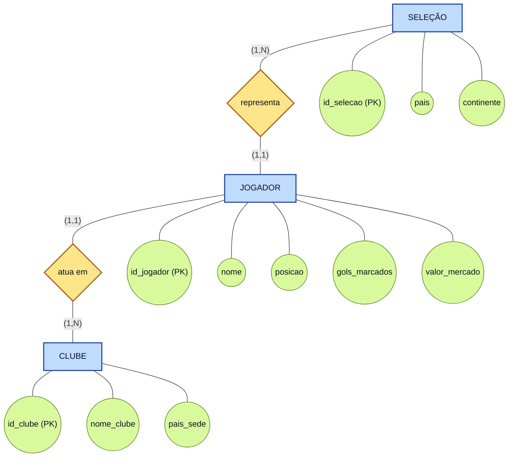

# 1.1 Modelo Conceitual

O modelo conceitual descreve **o que** o banco precisa armazenar, sem se preocupar
com tabelas, tipos de dados ou SGBD. É a visão mais próxima do mundo real, escrita
na notação de **Peter Chen** (entidades em retângulos, relacionamentos em losangos
e atributos em elipses).

## Entidades

| Entidade | O que representa |
|---|---|
| **SELEÇÃO** | O país que o jogador representa na Copa do Mundo. |
| **CLUBE** | O time onde o jogador atua no resto do ano (fora da competição). |
| **JOGADOR** | O atleta: é o **elo principal** do modelo, pois liga uma seleção a um clube. |

## Relacionamentos e regras de negócio

1. Um **JOGADOR** *representa* **uma** (e apenas uma) **SELEÇÃO**.
2. Um **JOGADOR** *atua em* **um** (e apenas um) **CLUBE**.
3. Uma **SELEÇÃO** é composta por **vários** JOGADORES.
4. Um **CLUBE** pode ceder **vários** JOGADORES para a competição.

Ou seja, os dois relacionamentos são do tipo **1:N** (um para muitos), sempre com o
lado "muitos" na entidade JOGADOR.

## Diagrama Entidade-Relacionamento (DER) — notação de Chen

## Leitura das cardinalidades

A notação `(mínimo, máximo)` é lida **do lado oposto** da ligação:

| Leitura | Cardinalidade | Significado |
|---|---|---|
| JOGADOR → SELEÇÃO | **(1,1)** | Todo jogador representa exatamente uma seleção (participação obrigatória). |
| SELEÇÃO → JOGADOR | **(1,N)** | Uma seleção inscrita no torneio tem no mínimo um e no máximo N jogadores. |
| JOGADOR → CLUBE | **(1,1)** | Todo jogador pertence a exatamente um clube. |
| CLUBE → JOGADOR | **(1,N)** | Um clube presente na base cedeu ao menos um jogador ao torneio. |

> **Observação de projeto:** como o enunciado afirma que o jogador joga por *uma*
> seleção e pertence a *um* clube, não existe relacionamento N:N neste modelo e,
> portanto, **nenhuma tabela associativa** será necessária no modelo lógico.
