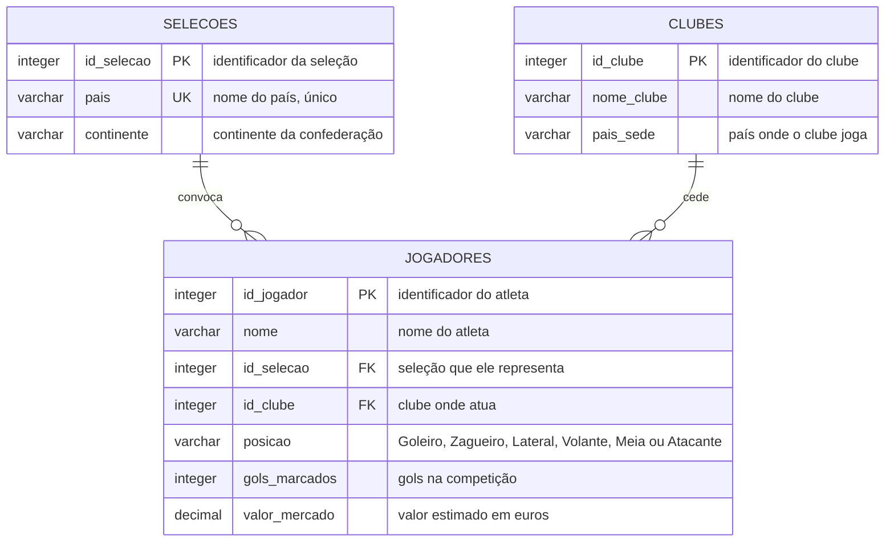

# 1.2 Modelo Lógico

O modelo lógico traduz o modelo conceitual para o **modelo relacional**: as entidades
viram tabelas, os atributos viram colunas e os relacionamentos 1:N viram **chaves
estrangeiras**. Ainda não há tipos de dados de um SGBD específico.

## Esquema relacional

```text
Selecoes  (id_selecao, pais, continente)
           PK: id_selecao

Clubes    (id_clube, nome_clube, pais_sede)
           PK: id_clube

Jogadores (id_jogador, nome, id_selecao, id_clube, posicao, gols_marcados, valor_mercado)
           PK: id_jogador
           FK: id_selecao -> Selecoes(id_selecao)
           FK: id_clube   -> Clubes(id_clube)
```

## Como os relacionamentos foram mapeados

Em todo relacionamento **1:N**, a chave primária do lado "1" **migra** para o lado "N"
como chave estrangeira:

| Relacionamento conceitual | Regra aplicada | Resultado |
|---|---|---|
| SELEÇÃO (1) — (N) JOGADOR | PK de `Selecoes` migra para `Jogadores` | coluna `Jogadores.id_selecao` |
| CLUBE (1) — (N) JOGADOR | PK de `Clubes` migra para `Jogadores` | coluna `Jogadores.id_clube` |

Como a participação do jogador é obrigatória nos dois lados (cardinalidade mínima 1),
as duas chaves estrangeiras são **NOT NULL**.

## Diagrama lógico (notação "pé de galinha")



## Dicionário de dados

### Selecoes

| Coluna | Domínio | Restrições | Descrição |
|---|---|---|---|
| `id_selecao` | inteiro | **PK**, gerado automaticamente | Identificador da seleção. |
| `pais` | texto (60) | NOT NULL, **UNIQUE** | País representado. Não pode haver duas seleções do mesmo país. |
| `continente` | texto (20) | NOT NULL, domínio fechado | Continente da confederação (América do Sul, América do Norte, Europa, África, Ásia, Oceania). |

### Clubes

| Coluna | Domínio | Restrições | Descrição |
|---|---|---|---|
| `id_clube` | inteiro | **PK**, gerado automaticamente | Identificador do clube. |
| `nome_clube` | texto (80) | NOT NULL | Nome do clube. |
| `pais_sede` | texto (60) | NOT NULL | País onde o clube disputa seu campeonato nacional. |
| — | — | **UNIQUE (nome_clube, pais_sede)** | Chave candidata: não existem dois clubes de mesmo nome no mesmo país. |

### Jogadores

| Coluna | Domínio | Restrições | Descrição |
|---|---|---|---|
| `id_jogador` | inteiro | **PK**, gerado automaticamente | Identificador do atleta. |
| `nome` | texto (120) | NOT NULL | Nome do atleta. |
| `id_selecao` | inteiro | **FK** → `Selecoes`, NOT NULL | Seleção que o jogador representa. |
| `id_clube` | inteiro | **FK** → `Clubes`, NOT NULL | Clube onde o jogador atua. |
| `posicao` | texto (20) | NOT NULL, domínio fechado | Posição em campo. |
| `gols_marcados` | inteiro | NOT NULL, DEFAULT 0, `>= 0` | Gols marcados na competição. |
| `valor_mercado` | decimal(15,2) | NOT NULL, DEFAULT 0, `>= 0` | Valor de mercado estimado, em euros. |

## Verificação de normalização

| Forma normal | Situação | Justificativa |
|---|---|---|
| **1FN** | Atendida | Todos os atributos são atômicos; não há grupos repetitivos nem listas dentro de uma coluna. |
| **2FN** | Atendida | Todas as chaves primárias são simples (uma única coluna), logo não existe dependência parcial. |
| **3FN** | Atendida | Nenhum atributo não-chave depende de outro atributo não-chave. `continente` depende de `pais`, mas `pais` é chave candidata de `Selecoes` — o que satisfaz também a **BCNF**. |

> **Por que `continente` fica em `Selecoes` e não em uma tabela `Continentes`?**
> Criar uma tabela separada seria possível, mas o continente é um atributo de domínio
> fechado e estável (seis valores). Ele é controlado por uma restrição `CHECK` no
> modelo físico, o que garante a integridade sem o custo de mais uma junção em toda
> consulta por continente.
