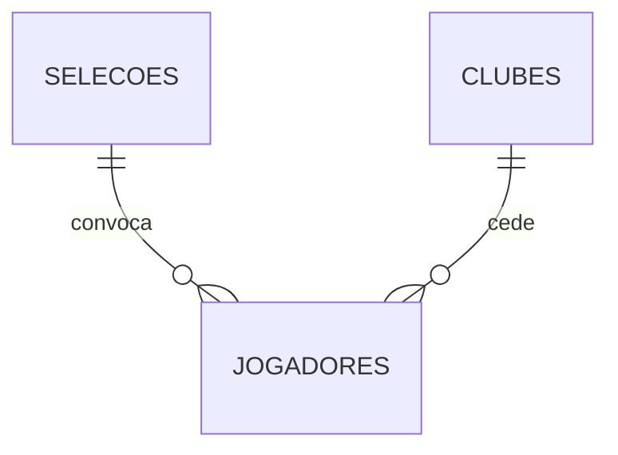

# Tarefa 1 — Modelo Conceitual, Lógico e Físico

**Laboratório Prático: SQL DML Avançado — Especial Copa do Mundo**

## Contexto do desafio

O comitê organizador da Copa do Mundo da FIFA contratou a turma como Engenheiros de
Dados. O banco de dados do torneio armazena informações sobre as **Seleções**
participantes, os **Clubes** de origem dos atletas e o desempenho individual de cada
**Jogador**. A imprensa e a diretoria da FIFA precisam de relatórios estratégicos e
análises complexas sobre a competição.

Esta primeira tarefa entrega a **modelagem de dados** que sustenta esses relatórios,
nos três níveis de abstração.

## Entregas

| # | Arquivo | Conteúdo |
|---|---|---|
| 1 | [`01-modelo-conceitual.md`](01-modelo-conceitual.md) | Entidades, atributos, relacionamentos, cardinalidades e DER na notação de Chen. |
| 2 | [`02-modelo-logico.md`](02-modelo-logico.md) | Esquema relacional, mapeamento dos relacionamentos 1:N, dicionário de dados e verificação de normalização (1FN, 2FN, 3FN). |
| 3 | [`03-modelo-fisico.sql`](03-modelo-fisico.sql) | Script DDL para PostgreSQL: tabelas, tipos, chaves, restrições e índices. |
| — | [`04-carga-dados.sql`](04-carga-dados.sql) | Complemento: carga DML com 8 seleções, 22 clubes e 32 jogadores. |
| — | [`05-consultas-verificacao.sql`](05-consultas-verificacao.sql) | Complemento: consultas e testes que comprovam o funcionamento do modelo. |

## Resumo do modelo

```text
Selecoes  (id_selecao, pais, continente)
Clubes    (id_clube, nome_clube, pais_sede)
Jogadores (id_jogador, nome, id_selecao*, id_clube*, posicao, gols_marcados, valor_mercado)

* chaves estrangeiras
```



A entidade **Jogador** é o elo principal: cada atleta representa **uma** seleção e
pertence a **um** clube, o que produz dois relacionamentos **1:N** e nenhuma tabela
associativa.

## Como executar

Testado no **PostgreSQL 16**.

```bash
# 1. Criar o banco
createdb copa_do_mundo

# 2. Criar a estrutura (DDL)
psql -d copa_do_mundo -f 03-modelo-fisico.sql

# 3. Popular com os dados de exemplo (DML)
psql -d copa_do_mundo -f 04-carga-dados.sql

# 4. Conferir que o modelo funciona
psql -d copa_do_mundo -f 05-consultas-verificacao.sql
```

O script `05` termina imprimindo um `OK` para cada restrição de integridade testada
(chave estrangeira, domínio de posição, gols negativos, país duplicado e exclusão de
seleção com jogadores) sem deixar nenhum registro extra no banco.

## Adaptação para MySQL

Os scripts usam SQL padrão, com três construções específicas do PostgreSQL. Para
rodar no MySQL 8:

| PostgreSQL | MySQL 8 |
|---|---|
| `INTEGER GENERATED BY DEFAULT AS IDENTITY` | `INT AUTO_INCREMENT` |
| `NUMERIC(15,2)` | `DECIMAL(15,2)` (equivalente) |
| `COMMENT ON TABLE/COLUMN ...` | `COMMENT '...'` na própria definição da coluna |
| `SELECT setval(pg_get_serial_sequence(...))` | desnecessário — remover as três linhas |

O bloco `DO $$ ... $$` do script `05` é exclusivo do PL/pgSQL; no MySQL basta rodar
os `INSERT` de teste manualmente e observar o erro retornado.

## Observação sobre os dados

Os nomes de seleções, clubes e atletas são reais, mas **gols marcados, valores de
mercado e os vínculos jogador–clube são fictícios**, criados apenas para dar volume
ao exercício. Não devem ser usados como fonte estatística.
