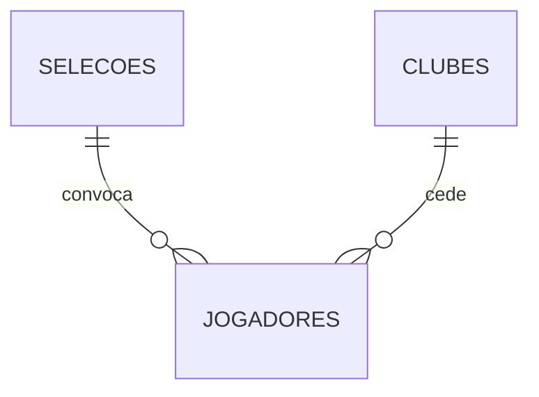

# Tarefa 1 — Modelo Conceitual, Lógico e Físico + Carga Inicial

**Laboratório Prático: SQL DML Avançado — Especial Copa do Mundo**

## Contexto do desafio

O comitê organizador da Copa do Mundo da FIFA contratou a turma como Engenheiros de
Dados. O banco de dados do torneio armazena informações sobre as **Seleções**
participantes, os **Clubes** de origem dos atletas e o desempenho individual de cada
**Jogador**. A imprensa e a diretoria da FIFA precisam de relatórios estratégicos e
análises complexas sobre a competição.

A tarefa tem duas etapas:

1. **Modelagem** — projetar o banco nos três níveis de abstração.
2. **Carga inicial (Data Entry)** — o banco foi criado com sucesso, mas está
   completamente vazio. A diretoria enviou as planilhas oficiais com 10 Seleções,
   10 Clubes e os principais Jogadores do torneio.

## Entregas

| Etapa | Arquivo | Conteúdo |
|---|---|---|
| Modelagem | [`01-modelo-conceitual.md`](01-modelo-conceitual.md) | Entidades, atributos, relacionamentos, cardinalidades e DER na notação de Chen. |
| Modelagem | [`02-modelo-logico.md`](02-modelo-logico.md) | Esquema relacional, mapeamento dos relacionamentos 1:N, dicionário de dados e verificação de normalização (1FN, 2FN, 3FN). |
| Modelagem | [`03-modelo-fisico.sql`](03-modelo-fisico.sql) | Script DDL para PostgreSQL: tabelas, tipos, chaves, restrições e índices. |
| Carga inicial | [`04-carga-dados.sql`](04-carga-dados.sql) | **Data Entry** com os dados oficiais das 3 planilhas da FIFA + desafio bônus. |
| Verificação | [`05-consultas-verificacao.sql`](05-consultas-verificacao.sql) | Consultas e testes que comprovam o funcionamento do modelo e das restrições. |

## Resumo do modelo

```text
Selecoes  (id_selecao, pais, continente)
Clubes    (id_clube, nome_clube, pais_sede)
Jogadores (id_jogador, nome, id_selecao*, id_clube*, posicao, gols_marcados, valor_mercado)

* chaves estrangeiras
```



A entidade **Jogador** é o elo principal: cada atleta representa **uma** seleção e
pertence a **um** clube, o que produz dois relacionamentos **1:N** e nenhuma tabela
associativa.

## A pergunta da carga inicial: qual tabela preencher primeiro?

> *"Lembrem-se das Chaves Estrangeiras (FK). Pensem bem: qual tabela deve ser
> preenchida primeiro para que o banco não apresente um erro de relacionamento?"*

**Resposta: primeiro as tabelas referenciadas — `selecoes` e `clubes` — e só depois
`jogadores`.**

Cada linha de `jogadores` carrega as FKs `id_selecao` e `id_clube`. No momento do
`INSERT`, o SGBD confere se aquele valor existe na tabela de destino. Entre `selecoes`
e `clubes` a ordem é indiferente, porque as duas são independentes entre si — o que
não pode é qualquer uma delas vir depois de `jogadores`.

Comprovação: tentando inserir o primeiro jogador da planilha em um banco vazio, o
PostgreSQL recusa a operação.

```text
ERROR:  insert or update on table "jogadores" violates foreign key constraint "fk_jogadores_selecao"
DETAIL:  Key (id_selecao)=(10) is not present in table "selecoes".
```

Por isso o script `04-carga-dados.sql` segue exatamente a ordem das tarefas do
enunciado: Seleções → Clubes → Jogadores.

## Ajustes no modelo após a chegada das planilhas

As planilhas oficiais trouxeram duas informações que a modelagem inicial não
conhecia. O modelo físico foi ajustado para receber os dados **exatamente como a FIFA
os enviou**, sem conversão nem tradução:

| O que mudou | Antes | Depois | Motivo |
|---|---|---|---|
| Domínio de `posicao` | `'Meia'` | `'Meio-Campo'` | Nomenclatura usada na Planilha 3. Manter os dois valores como sinônimos permitiria cadastros inconsistentes, então o vocabulário oficial passou a ser o único aceito. |
| Unidade de `valor_mercado` | euros, `NUMERIC(15,2)` | **milhões** de euros, `NUMERIC(10,2)` | A Planilha 3 informa "Valor de Mercado (Milhões)": `150.00` = 150 milhões. Com a unidade em milhões, 15 dígitos ficariam superdimensionados. |

## Dados carregados

| Tabela | Registros | Origem |
|---|---|---|
| `selecoes` | 10 | Planilha 1 — IDs 10 a 100 |
| `clubes` | 10 | Planilha 2 — IDs 1 a 10 |
| `jogadores` | 10 + 1 | Planilha 3 — IDs 101 a 110, mais o desafio bônus (ID 111) |

> ⚠️ **Desafio bônus — personalize antes de entregar.** O último `INSERT` do
> `04-carga-dados.sql` está com o nome `'Seu Nome Aqui'` e valores de exemplo. Troque
> pelo seu nome, sua seleção do coração, seu clube, sua posição, seus gols e seu valor
> de mercado. Os IDs válidos estão listados no comentário logo acima do comando.

## Como executar

Testado no **PostgreSQL 16**.

```bash
# 1. Criar o banco
createdb copa_do_mundo

# 2. Criar a estrutura (DDL)
psql -d copa_do_mundo -f 03-modelo-fisico.sql

# 3. Carga inicial com os dados oficiais da FIFA (DML)
psql -d copa_do_mundo -f 04-carga-dados.sql

# 4. Conferir que o modelo funciona
psql -d copa_do_mundo -f 05-consultas-verificacao.sql
```

O script `04` termina imprimindo o elenco completo com as três tabelas ligadas por
`JOIN`. O script `05` imprime um `OK` para cada restrição de integridade testada
(chave estrangeira, domínio de posição, gols negativos, país duplicado e exclusão de
seleção com jogadores) sem deixar nenhum registro extra no banco.

## Adaptação para MySQL

Os scripts usam SQL padrão, com algumas construções específicas do PostgreSQL. Para
rodar no MySQL 8:

| PostgreSQL | MySQL 8 |
|---|---|
| `INTEGER GENERATED BY DEFAULT AS IDENTITY` | `INT AUTO_INCREMENT` |
| `NUMERIC(10,2)` | `DECIMAL(10,2)` (equivalente) |
| `COMMENT ON TABLE/COLUMN ...` | `COMMENT '...'` na própria definição da coluna |
| `SELECT setval(pg_get_serial_sequence(...))` | desnecessário — remover as três linhas |
| `TO_CHAR(valor, 'FM999G990D00')` | `FORMAT(valor, 2)` |
| `\echo` (comando do psql) | remover as linhas ou trocar por `SELECT '...';` |

O bloco `DO $$ ... $$` do script `05` é exclusivo do PL/pgSQL; no MySQL basta rodar
os `INSERT` de teste manualmente e observar o erro retornado.
